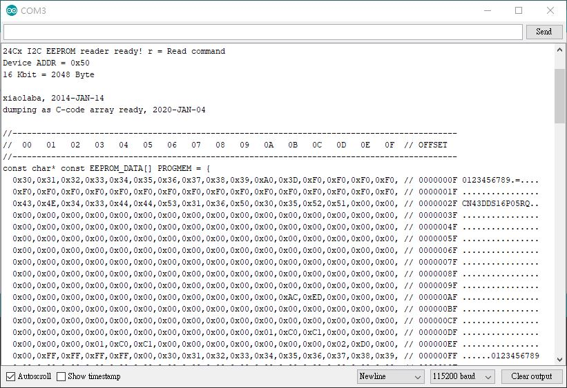

# 24C16_reader
Arduino based, read 24C16, dump as HEX and printable ASCII, and C-code array ready  

/*
 * Dump 24C16 to screen
 * 
 * xiaolaba, 2014-JAN-14, init, uses library, https://github.com/yazug/EEPROM24C04_16, modified.
 * xiaolaba, 2020-JAN-04, revise dump format to C-code array ready 
 * 
 * Arduino IDE 1.8.9 (Windows Store 1.8.21.0)
 * 
 * hardware connection,
 * 
 * 24C04 pin#   <-> Ardunino Nano pin# (Atmega168)
 * 1, A0        <-> GND
 * 2, A1        <-> GND
 * 3, A2        <-> GND
 * 4, GND       <-> GND
 * 5, SDA       <-> A4, SDA(Mega168/328)
 * 6, SCL       <-> A5, SCL(Mega168/328)
 * 7, /WP       <-> GND, always enable write
 * 8, VCC, +5V  <-> VCC, +5V
 * 
 * Serial, 115200 baud
 */

result,

  

library used, modified, https://github.com/yazug/EEPROM24C04_16, no fork, but local copy

## hex  
  

## dump examples  
  
  
  

## modified library
  

